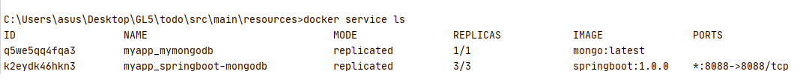

# Mini-Project 
Il s'agit d'un projet SpringBoot "Todo" contenant deux REST API
pour lister et créer des Todos.

### Travail demandé 


On doit répondre à ses points : 
* L'application SpringBoot communique avec MongoDB à travers un réseau privé.
* La base de données MongoDB est liée à un volume.
* La base de données n'expose pas son ports.
* Dupliquer l'application SpringBoot (replicas) et utilisation de docker swarm.


Pour cela, on a créé d'abord un dockerfile et un docker-compose. 

```bash
$ docker stack deploy -c myapp
$ docker swarm init
$ docker service ls
```
### Execution



